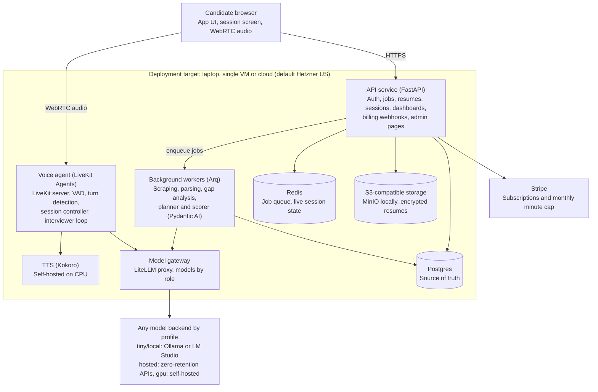

# Strong Hire: Product & Technical Spec v1

Updated Oct 5, 2026 · Mo Soliman

## Overview

Strong Hire is a voice-first web app where tech candidates rehearse a real interview for a specific job at a specific company, then get a debrief-style hire signal and a plan for what to fix. v1 launches in December 2026 as a B2C subscription for the US and Canada, with B2B (bootcamps, universities, outplacement firms) planned later.

**Problem.** Candidates prep with generic question lists and friends who aren't trained interviewers. They rarely hear how a hiring committee would actually judge them for one role at one company, and they get no honest read on their gaps before the real loop.

**Target user.** Tech candidates (software engineers, data and ML, product managers, designers, TPMs) with a real interview coming up, from new grad to staff/principal.

**What makes it different.**

- Starts from the actual job posting, the candidate's resume, and a curated profile of the company's interview style
- Runs a gap analysis and match score before any practice, so the interviewer probes real weaknesses
- Behaves like a trained interviewer: adaptive follow-ups, company persona, seniority calibration, difficulty levels
- Ends with the verdict a debrief would produce (Strong Hire to No Hire) and a per-question rubric

**North star metric (first 6 months):** paying subscribers.

**Design principles.**

- **Model-agnostic.** No feature depends on a specific model or provider. Code asks for a role, such as interviewer or scorer, and configuration decides which model serves it. Adding or swapping a model is a config change plus a passing conformance suite.
- **Runs anywhere.** The same container images run on a laptop with one small model, on a single cloud VM, or on a larger cloud setup. Moving between them changes configuration only, never code or images.

## Scope

v1 is deliberately narrow: tech roles, 20 curated companies plus a generic mode, English only, voice on desktop web.

| Area | v1 (Dec 2026) | Later releases | Out of scope |
| --- | --- | --- | --- |
| Platform | Desktop web app | Native iOS and Android | Mobile web as a primary target |
| Modality | Real-time voice | AI interviewer video avatar (v2) | Candidate video, posture or eye contact analysis |
| Roles | Tech only: SWE, data/ML, PM, design, TPM | Adjacent corporate roles | Non-tech roles |
| Companies | 20 curated profiles researched offline and imported, generic mode for others | Auto-profiles for other companies at job setup, more curated profiles, community interview reports | |
| Interview types | Behavioral, hiring manager deep dive, verbal technical Q&A, case (product sense, estimation, system thinking) | Recruiter screen, panel with multiple personas | Live coding, whiteboard, written system design |
| Feedback | Hire signal with rationale, per-question rubric, progress tracking | Transcript view, model answers, delivery metrics (pace, fillers), story bank: the candidate's strongest answers saved as reusable stories, tagged by competency (e.g. conflict management, leadership) | Audio playback (audio is deleted after scoring) |
| Modes | Coach and Realistic, chosen at session start | | |
| Business | B2C, one paid plan with monthly cap | Org accounts and seats (B2B) | |
| Markets | US and Canada, English | Other languages (Arabic is a candidate) | |

The 20 launch companies: Google, Amazon, Microsoft, Meta, Apple, Netflix, Nvidia, Salesforce, Uber, Stripe, OpenAI, Anthropic, Airbnb, Shopify, LinkedIn, Oracle, Adobe, Databricks, Snowflake, Atlassian. eBay was dropped from the list to avoid a conflict with your current employer; Atlassian is a placeholder for the 20th slot.

**Environments.** Development runs fully local on Docker for several weeks, using small open-weight models on your machine. Hosting on Hetzner starts only when the product works end to end locally. Moving between the two is a configuration change, not a code change.

## User journeys

A new candidate reaches a match score in under 5 minutes and finishes a first free interview in under 40.

**1. First visit to first value (free)**

1. Sign up with email or Google, accept terms, opt in or out of training-data use (default out).
2. Paste a job posting URL or text. The app extracts company, title, level and requirements, and shows them for confirmation.
3. Upload a resume (PDF or DOCX) or paste text.
4. Optional context: interview stage, interviewer name or role, recruiter notes, worries.
5. App shows the gap analysis: match score, strengths, gaps, likely probe areas, and a recommended first session.

**2. Interview session**

1. Candidate picks interview type, difficulty (Friendly, Realistic, Tough), duration (30 or 45 min) and mode (Coach or Realistic).
2. Mic check and a 10-second latency test.
3. Interviewer opens with intro and small talk, sets the agenda, then runs core questions with follow-ups.
4. Coach mode only: candidate can pause, ask for a hint, or redo an answer.
5. Interviewer asks "Any questions for me?", answers in persona, and wraps up.
6. Audio is discarded once scoring finishes; transcript is kept for scoring and progress.

**3. Debrief**

1. Within 60 seconds of the session ending, the candidate sees the hire signal and its rationale.
2. Per-question breakdown: rubric scores, what was strong, what was missing.
3. Recommended next session, tied back to open gaps.

**4. Conversion and return**

1. After the free interview, the paywall offers the monthly plan.
2. Dashboard shows each target job, its match score, sessions run, and the trend of Realistic-mode scores per competency.
3. Candidate can add a new job posting at any time; each job keeps its own gap analysis and history.

## Functional requirements

IDs are referenced by the build plan and acceptance tests. Priority: P0 must ship in v1, P1 ships if time allows.

| ID | Requirement | Priority |
| --- | --- | --- |
| IN-1 | Accept job posting as pasted text or URL; scrape common boards (Greenhouse, Lever, Ashby, Workday, company career pages). LinkedIn falls back to paste. | P0 |
| IN-2 | Extract structured job data: company, title, level, team, must-have and nice-to-have skills, responsibilities. User confirms or edits. | P0 |
| IN-3 | Accept resume as PDF, DOCX or text; parse into roles, achievements, skills, dates. | P0 |
| IN-4 | Optional context fields: stage, interviewer name/role, recruiter notes, concerns. | P0 |
| IN-5 | Match company to one of 20 profiles, else run generic mode. | P0 |
| GA-1 | Produce match score (0 to 100) with breakdown by competency and requirement. | P0 |
| GA-2 | List strengths with resume evidence, gaps with severity, and likely probe areas. | P0 |
| GA-3 | Generate a session plan: which interview types and topics to practice first. | P0 |
| GA-4 | Gap analysis is free and does not consume plan minutes. | P0 |
| IV-1 | Real-time voice interview with barge-in (candidate can interrupt) and turn detection. | P0 |
| IV-2 | Four interview types: behavioral, hiring manager deep dive, verbal technical Q&A, case. | P0 |
| IV-3 | Adaptive follow-ups on vague, unquantified or off-topic answers (up to 3 probes per question). | P0 |
| IV-4 | Difficulty levels: Friendly, Realistic, Tough. Tough challenges assumptions and pushes back. | P0 |
| IV-5 | Company persona from the profile (values framework, question style, bar). | P0 |
| IV-6 | Seniority calibration from the job level: new grad, mid, senior, staff/principal. | P0 |
| IV-7 | Session structure: intro, small talk, core questions, candidate questions, wrap-up; 30 or 45 min timer. | P0 |
| IV-8 | Mode chosen at start. Coach: pause, hint, redo. Realistic: no interruptions, counts toward scores. | P0 |
| IV-9 | Graceful recovery from dropped audio: resume the session where it stopped. | P0 |
| FB-1 | Overall hire signal (Strong Hire, Hire, Lean Hire, Lean No Hire, No Hire) with a short written rationale. | P0 |
| FB-2 | Per-question rubric scores with strengths and misses. | P0 |
| FB-3 | Debrief ready within 60 seconds of session end. | P0 |
| PR-1 | Progress dashboard per target job: competency trends from Realistic sessions only. | P0 |
| PR-2 | Recommended next session based on remaining gaps. | P0 |
| PR-3 | Interview rehearsals: the user picks a job description and a CV, or adds one. For that pair, the app shows the earlier gap reports, debriefs and hire signals. | P0 |
| BL-1 | Stripe subscription, one plan, monthly minute cap, usage meter visible in the app. | P0 |
| BL-2 | Free tier: unlimited gap analyses (rate limited) plus one free interview. | P0 |
| AC-1 | Self-service export and full delete of account and all data. | P0 |
| AC-2 | Training-data consent toggle, off by default, changeable any time. | P0 |
| AC-3 | At the first sign-in, ask for a short profile: full name, years of experience and target level, plus optional current title, country, time zone and LinkedIn URL. No payment details. The user edits it under Account, Profile. | P0 |
| LB-1 | A top-level Resumes page lists saved CVs. The user can add, rename and delete a CV there. | P0 |
| LB-2 | A top-level Job descriptions page lists saved job postings. A job description with no gap report and no session can be deleted. One that has reports can be archived and restored; a "Show archived" switch shows archived ones. | P0 |
| AD-1 | Profile import command: validate a profile JSON file against the schema, store it as a new version with sources and import date, and publish it after confirmation. | P0 |
| AD-2 | Admin dashboard: users, sessions, cost per session, failed sessions. | P1 |
| PL-1 | Every model call is routed by role through the model gateway, so local and hosted models switch by config (see Architecture). | P0 |
| PL-2 | Runtime profiles chosen by config only: `tiny` (one small model for all text roles, CPU), `local` (two local models), `hosted` (API providers), `gpu` (self-hosted inference). Switching needs no code change. | P0 |
| PL-3 | Works with weak models: without JSON mode or tool calls, the gateway falls back to grammar-constrained output plus repair and retry; with a small context window, the scorer works one question at a time. | P0 |
| PL-4 | Model conformance suite: a model is onboarded by config and by passing a standard test suite for each role it serves. CI runs it on at least two model families per role. | P0 |
| PL-5 | Prompt variants by capability tier, never by model name. Small models get simpler prompts; code picks the variant from the model's tier. | P0 |
| PL-6 | Provenance on every AI output: profile, model ID and prompt version. Outputs from `tiny` or `local` are marked as development data and excluded from real progress trends. | P0 |
| PL-7 | Text-only session mode behind a dev flag, so the interviewer runs as text when local voice is too slow; the simulated-candidate tests reuse it. | P0 |
| PL-8 | Cloud-portable deployment: only Postgres, Redis and S3-compatible storage (MinIO locally). Hetzner is the default target; only provisioning scripts are provider-specific. | P0 |

## Interviewer and scoring design

The interviewer and the scorer are separate components. The interviewer runs the conversation in real time; the scorer judges the full transcript afterward, the way a debrief panel reads interview notes. Keeping them apart stops the live model from softening its judgment mid-conversation and lets the scorer use a stronger, slower model.

**Interviewer brief.** Before each session, a planner builds a brief from the job, resume, gap analysis, company profile, interview type, level, difficulty and mode. The brief lists 4 to 6 target competencies, 6 to 10 candidate questions ranked by priority, the probe areas from the gap analysis, and the persona's tone. The live interviewer works from the brief, not from raw documents, which keeps prompts short and latency low.

**Conversation state machine.** INTRO → SMALL_TALK → AGENDA → CORE (question → answer → follow-up loop) → CANDIDATE_QUESTIONS → WRAP_UP. A session controller owns the timer and moves phases; the LLM never decides when the session ends.

**Follow-up rules.** The interviewer probes when an answer lacks the candidate's own role, a measurable result, a concrete example, or trade-off reasoning. Max 3 probes per question, fewer in Friendly mode. Tough mode adds pushback ("Why not the simpler option?") and one curveball per session.

**Competencies by interview type.**

| Interview type | Scored competencies |
| --- | --- |
| Behavioral | Ownership, impact, collaboration, conflict handling, learning from failure, communication |
| Hiring manager deep dive | Role fit, depth of relevant experience, judgment, motivation, team fit, scope at level |
| Verbal technical Q&A | Technical depth, accuracy, reasoning, trade-offs, clarity of explanation |
| Case | Problem framing, structure, user and business sense, estimation logic, prioritization, recommendation |

**Rubric.** Each answer is scored 1 to 4 per relevant competency (1 = no evidence, 2 = weak, 3 = meets the bar for this level, 4 = above the bar), with a quote-backed justification from the transcript. Level changes the bar, not the scale: a 3 for a staff candidate requires cross-team scope that a mid-level 3 does not.

**Hire signal.** Computed from competency averages weighted by the company profile, plus hard rules: any competency at 1 caps the result at Lean No Hire; Strong Hire requires an average at or above 3.5 with no competency below 3. The written rationale states the deciding evidence in 3 to 5 sentences, like a debrief summary.

**Calibration.** Before launch, build a gold set of 60 to 100 scored transcripts (written by you and a few experienced interviewers). The scorer must agree with the human hire signal within one band on 85 percent or more of them. Re-run this set on every model or prompt change.

## Company profiles

Each of the 20 companies gets a versioned profile, researched offline with Claude (Code or chat) against a fixed JSON schema, reviewed by you, then imported into the app. No research runs inside the app or during an interview. Profiles refresh quarterly, or on demand when a company changes its process.

**Profile structure (stored as versioned JSON).**

| Field | Contents |
| --- | --- |
| Values framework | Named principles (e.g. Amazon Leadership Principles) with what evidence of each sounds like |
| Loop structure | Typical rounds by role family and level, round length, who interviews |
| Question patterns | Recurring themes per interview type, phrased as patterns, not leaked questions |
| Bar by level | Level names (L5, E5, Senior) and scope expected at each |
| Persona notes | Interviewer tone, pace, pushback style, how they close |
| Scoring weights | Relative weight of each competency in the hire signal |
| Case style | Product sense vs estimation vs system thinking emphasis |
| Sources | URLs, retrieval date, confidence per field |
| Status | Draft, In review, Published, Archived; version number and reviewer |

**Pipeline.**

1. The profile JSON schema lives in the repo (`schemas/company_profile.schema.json`), generated from the app's Pydantic model so the two never drift.
2. Research happens in Claude Code or chat with a saved research prompt: public sources only, a citation and confidence level per field, low-confidence fields flagged.
3. You review the draft as it's produced and edit where needed.
4. The import command (`strongctl profiles import <file>`) validates the file, stores it as a new version, and shows a diff against the current published version before you confirm.
5. Each session records the profile version it used, so scores stay explainable after refreshes.
6. Quarterly refresh: the same prompt re-researches a company and outputs a diff for your approval.

**Content rules.** No leaked or NDA-protected questions, no copied paid content, no claims about specific named interviewers. Profiles describe patterns and expectations, which keeps the product on safe legal ground and still feels authentic.

**Companies outside the 20.**

- **v1, generic mode:** the brief is built from the job posting and resume alone, with a default tech-industry persona and equal competency weights. The UI labels it clearly.
- **v1, request this company:** requests are logged; the most-requested companies get promoted to curated profiles through the offline process.
- **First post-launch release, auto-profile:** when a candidate adds a job, a background step reads the company's own careers and values pages from the posting's domain and adds a short summary to the brief. It's cached per company, labeled "auto-generated", never changes scoring weights, and adds nothing to interview latency.

## Architecture

Python on the server end to end, a small TypeScript front end (browser audio needs it), and one voice pipeline that the v2 avatar can sit on top of. Every model call goes through a gateway by role, so the same code runs on small local models in Docker or on hosted models in production. When hosting starts, everything runs in Hetzner's US cloud region (Ashburn or Hillsboro) so voice audio stays close to North American users; hosting in Germany would add roughly 200 to 300 ms per turn.

The voice agent is the latency-critical path. Background workers do all slow work before and after a session, so the live loop only reads a short brief. The model gateway hides which provider or self-hosted GPU serves each model.

**Stack.**

| Layer | Choice | Why |
| --- | --- | --- |
| Front end | React + Vite (TypeScript), LiveKit client SDK | Minimal JS needed for WebRTC; same app hosts the admin pages |
| API | Python 3.12, FastAPI, SQLAlchemy 2, Alembic, Pydantic | Your preferred language; strong async support |
| Agent framework (non-voice) | Pydantic AI | Typed, validated outputs for gap analysis, brief and scorecard; works with any OpenAI-compatible endpoint |
| Voice transport | LiveKit server, self-hosted, open source | No per-minute transport fees; handles WebRTC and reconnects; runs in Docker locally |
| Voice agent | LiveKit Agents (Python), Silero VAD, LiveKit turn-detector model | Barge-in and end-of-turn detection out of the box |
| Model gateway | LiteLLM (proxy container) | One OpenAI-compatible endpoint; role aliases map to local or hosted models by config |
| Local models | Ollama container (default) or LM Studio on the host | Small open-weight models for development, CPU inference |
| Speech-to-text | faster-whisper locally; Whisper large-v3-turbo via hosted API in production | Same open weights in both environments |
| Interviewer LLM | Open-weight instruct model, chosen in week 1 | Fast first token, reliable instruction following |
| Scorer LLM | Strongest open-weight model available via API; fine-tuned later on consenting users' transcripts | Accuracy matters more than speed here |
| TTS | Kokoro-82M, streaming, on CPU in both environments | Near-zero cost, natural voices, open weights |
| Jobs | Arq on Redis | Simple async Python job queue |
| Scraping and parsing | httpx + trafilatura, Playwright fallback; pypdf and python-docx | Covers most job boards and resume formats |
| Auth | Google OAuth + email magic links (Authlib); local dev login bypass | No passwords to store |
| Billing | Stripe Checkout, Customer Portal, webhooks (test mode until launch) | Fastest path to subscriptions with usage caps |
| Deploy | Docker Compose locally (Docker Desktop with WSL2), same compose files on Hetzner later; Caddy for TLS; GitHub Actions | One stack definition for both environments |
| Observability | Sentry, Prometheus + Grafana, PostHog, OpenTelemetry traces from Pydantic AI | Errors, latency, cost and product analytics |

**Voice latency budget (target p50 under 800 ms).**

| Step | Budget |
| --- | --- |
| End-of-turn detection after the candidate stops | 200 to 300 ms |
| Speech-to-text on the final segment | 150 to 250 ms |
| LLM first token | 200 to 300 ms |
| TTS first audio chunk | 80 to 150 ms |
| Network and buffering, voice hosted in Hetzner US | 50 to 100 ms |

The interviewer streams its reply sentence by sentence into TTS, so audio starts before the full reply is generated.

**Fine-tuning path.** v1 ships on prompted base models. Once 500 or more consenting, PII-scrubbed sessions exist, fine-tune the scorer first (LoRA on the chosen open-weight model) against human-reviewed scorecards, then the interviewer's follow-up behavior. Every fine-tuned model must beat the base model on the gold set before release.

**Model-agnostic design.** No code outside the gateway knows which model or provider it is talking to. Code asks for a role; the active runtime profile decides the model. The OpenAI-compatible protocol is the only wire format, and no vendor SDK is imported outside the gateway.

| Role | Used by | tiny (laptop, CPU) | local (Docker, CPU) | hosted |
| --- | --- | --- | --- | --- |
| extractor | Job and resume parsing, company matching | One 3B to 4B quantized instruct model shared by all four text roles | 3B to 4B, quantized | Mid-size open-weight |
| planner | Gap analysis, interviewer brief | (same model) | 7B to 8B, quantized | 70B-class open-weight |
| interviewer | Live voice loop | (same model) | 3B to 4B, for speed | Fast 70B-class, low-latency provider |
| scorer | Debrief and hire signal | (same model) | 7B to 8B, quantized | Strongest open-weight available |
| stt | Voice input | faster-whisper tiny or base | faster-whisper small, int8 | Whisper large-v3-turbo |
| tts | Voice output | Kokoro on CPU | Kokoro on CPU | Kokoro on cloud CPU |

A fourth profile, `gpu`, points the same roles at self-hosted inference (for example vLLM) when hosted API spend justifies a GPU server.

Rules that keep it agnostic:

- Role mapping lives in `config/models.<profile>.yaml`, selected by `MODEL_PROFILE`.
- A capability registry records per model: tool calls, JSON mode, grammar support, context window and a capability tier (small, medium, large). Code checks capabilities and tiers, never model names.
- Prompts live in `prompts/<role>/<name>.<tier>.v<N>.txt`. Small-tier prompts are shorter and ask for one thing at a time.
- Structured output goes through Pydantic AI with validation. When a model lacks JSON mode, the gateway uses grammar-constrained decoding where the backend supports it, then a repair-and-retry step, then fails loudly.
- A deterministic fake model (recorded fixtures) lets tests and CI run with no model at all.

**Inference contracts.** Each role is an internal API with a fixed contract. The browser never calls these directly; the product API wraps them.

| Role | Input | Output | Minimum capability | Fallback on a small model | Latency target (hosted) |
| --- | --- | --- | --- | --- | --- |
| extractor | Raw posting or resume text | JobPosting or Resume with field confidence | 4k context, structured output | Extract sections in separate calls | Under 10 s |
| planner | Job, resume, profile, session config | GapAnalysis ratings, InterviewerBrief | 8k context, structured output | Rate requirements in batches; score computed in code | Under 20 s |
| interviewer | Brief, recent turns, controller state | Streamed reply plus a small probe-or-move-on decision | 4k context, streaming | Shorter turn window; decision via constrained choice | First token under 300 ms |
| scorer | Transcript, brief, rubric, profile weights | Per-question and per-competency scores with quotes; rationale | 16k context, structured output | Score one question per call; hire signal always computed in code | Under 45 s for the whole session |
| stt | Audio segment | Text with timings | Streaming or segment mode | Smaller Whisper model | Under 250 ms per final segment |
| tts | Text sentence | Audio stream | Streaming | None needed | First chunk under 150 ms |

**Deployment targets.**

| Target | How it runs | Model profile | What changes |
| --- | --- | --- | --- |
| Laptop, minimal | Docker Compose `all-in-one` profile, no GPU, about 8 to 10 GB RAM free | `tiny` | Nothing but the `.env` file |
| Laptop, full | Docker Compose `core` + `models` + `voice` | `local` or `hosted` | `.env` and API keys |
| Single cloud VM (beta) | The same Compose files with production overrides; Caddy for TLS | `hosted` | `.env`, secrets, domain names |
| Scaled cloud (later) | The same images on a container platform or Kubernetes, managed Postgres and S3 | `hosted` or `gpu` | Deployment manifests only |

Nothing in the app depends on a specific cloud. Storage goes through the S3 API (MinIO locally), and only the provisioning scripts know about Hetzner.

**Local development environment.** Windows with Docker Desktop on WSL2, helper scripts in PowerShell, CPU-only inference (Intel Arc, no CUDA, 32 GB RAM). LM Studio on the host can stand in for Ollama (the gateway reaches it at `host.docker.internal:1234`).

Docker Compose profiles:

- `all-in-one`: everything on the `tiny` profile, for the smallest machine
- `core`: Postgres, Redis, MinIO, API, worker, web
- `models`: Ollama and the LiteLLM gateway
- `voice`: LiveKit server, voice agent, faster-whisper, Kokoro

Expect slow voice turns and weak interviewing on `tiny`; use the text-only session mode (PL-7) for day-to-day work. The phase 1 latency gate is measured with the app still running locally but the `hosted` model profile pointed at real APIs.

## Data model

Postgres is the single source of truth, with an `org_id` on every user-owned table from day one so B2B tenancy is a feature flag later, not a migration. In v1 every user gets a personal org.

| Entity | Key fields | Notes |
| --- | --- | --- |
| Org | id, name, type (personal, business), plan | One personal org per user in v1 |
| User | id, org_id, email, auth_provider, training_consent, created_at | Consent defaults to false |
| Subscription | user_id, stripe_customer_id, status, period_start, period_end, minutes_cap, minutes_used | Usage resets each period |
| Resume | id, user_id, parsed_json, file_ref, uploaded_at | Original file encrypted in object storage |
| JobTarget | id, user_id, company_id (nullable), source_url, raw_text, parsed_json, level, stage, context_notes | Null company_id means generic mode |
| Company | id, name, slug, active | The 20 launch companies |
| CompanyProfile | id, company_id, version, status, profile_json, sources_json, reviewed_by, published_at | Only Published versions are used |
| GapAnalysis | id, job_target_id, resume_id, match_score, breakdown_json, session_plan_json, model_profile, model_id, prompt_version | Recomputed when resume or job changes |
| Session | id, job_target_id, type, difficulty, mode, channel (voice or text), duration_min, profile_version, brief_json, model_profile, interviewer_model_id, prompt_version, status, started_at, ended_at, minutes_billed | Coach and dev-profile sessions excluded from trends |
| Turn | id, session_id, speaker, phase, text, start_ms, end_ms, question_ref | Transcript only, no audio |
| Scorecard | id, session_id, hire_signal, rationale, competency_scores_json, value_scores_json, per_question_json, model_profile, model_id, prompt_version, rubric_version | One per Realistic or Coach session. Value scores are empty in generic mode |
| ProgressSnapshot | id, job_target_id, competency, score, session_id, at | Realistic sessions only |
| UsageEvent | id, session_id, component (stt, llm, tts), units, cost_usd | Drives cost per session tracking |
| CompanyRequest | id, org_id, user_id, job_target_id, company_name, normalized_name, matched_company_id, source_host, created_at | Every company name entered at job setup. Null matched_company_id means a request for a company outside the 20 |
| AuditLog | id, actor, action, entity, at | Deletes, exports, consent changes, profile approvals |

The model registry and runtime profiles live in config files, not the database. Provenance fields (PL-6) are written on every AI output so results from different models are never mixed silently.

## Privacy, security and compliance

The design rule is to keep as little as possible: audio never touches disk, and everything else can be deleted by the user in one click.

**Regulations in scope.** US and Canada users only at launch. Design for CCPA/CPRA (California), PIPEDA (Canada federal) and Quebec Law 25, which is the strictest of the three and requires a privacy impact assessment before transferring personal data outside Quebec. Hosting in Hetzner's US region keeps US users' data in the US; Canadian users' data still crosses a border, so the privacy policy must disclose it plainly. Have a privacy lawyer review the policy and terms before launch; this spec is not legal advice.

**Data handling.**

- Audio streams through memory only and is dropped when the session's scoring completes. No recordings in storage, logs or backups.
- Transcripts, resumes and scorecards are encrypted at rest (Postgres disk encryption plus app-level encryption for resume files).
- TLS everywhere, including WebRTC media (DTLS-SRTP).
- Training-data use is opt-in, off by default. Only transcripts of consenting users enter the training pool, after PII scrubbing (names, employers, emails, phone numbers).
- Third-party model APIs used during beta must contractually not retain or train on inputs; pick providers that offer zero data retention.

**User rights (self-service in v1).** Export all data as JSON plus original resume files. Delete account removes all rows and files within 24 hours and purges backups on their normal rotation (30 days max), with the deletion recorded in the audit log.

**Security basics.** Passwordless or OAuth login, rate limits on scraping and gap analysis, server-side prompt templates only (no user text can change system instructions), prompt-injection filtering on job postings and resumes, secrets in a vault, least-privilege admin roles, and an AuditLog for sensitive actions.

**Age.** Users must be 18 or older; enforce at sign-up in the terms and a checkbox.

## Pricing and cost model

A 45-minute session should cost roughly $0.40 to $0.80 in AI usage, so the beta fits comfortably under $300 a month and a $29 plan carries healthy margin. All figures below are approximate planning estimates from memory, not quotes; verify current provider pricing before committing.

During the local development period, infrastructure cost is close to zero: everything runs in Docker on your machine, and hosted model APIs are only called for latency and quality tests.

**Beta infrastructure strategy.** Run the app, database and voice orchestration on Hetzner CPU cloud servers in the US region. Use pay-per-use hosted open-weight model APIs (for example Groq, Together, DeepInfra or Fireworks) for speech-to-text and the LLM, and run an open-source TTS model (Kokoro) on the Hetzner CPU box. Move the LLM to a dedicated GPU server only when monthly API spend clearly exceeds the server's fixed cost.

**Monthly fixed costs (approximate).**

| Item | Est. USD/month |
| --- | --- |
| App and API server (Hetzner cloud CCX, US region) | 40 |
| Postgres server with backups | 25 |
| Voice worker running TTS and media | 40 |
| Object storage, domain, email, monitoring | 15 |
| Total fixed | 120 |

**Variable cost per 45-minute session (approximate).**

| Component | Basis | Est. USD |
| --- | --- | --- |
| Speech-to-text | ~27 min of candidate speech on hosted Whisper-class model | 0.02 to 0.10 |
| Live interviewer LLM | ~60 turns, ~4k input tokens each with prompt caching, 70B-class open model | 0.15 to 0.35 |
| Planner and gap analysis | 2 to 3 calls before the session | 0.05 |
| Scorer | One long call on a stronger model over the full transcript | 0.10 to 0.25 |
| TTS | Self-hosted on CPU | ~0 |
| Total per session | | 0.40 to 0.80 |

At about $0.60 per session, the $180 left after fixed costs covers roughly 300 sessions a month during beta.

**Suggested plan.** $29 per month (or $24 per month billed annually) for 300 interview minutes, about six 45-minute sessions. Gap analyses are unlimited with fair-use rate limits. A heavy user at the full cap costs about $4 in AI usage, plus Stripe fees of about $1.15. Treat the price as a hypothesis: test $19, $29 and $39 on the paywall during beta.

**GPU crossover.** A dedicated Hetzner GPU server (the GEX44 class, roughly $200 a month) can run a quantized 30B to 70B-class model for low concurrency. Switch when hosted LLM spend passes about $250 a month for two months running, and only after load testing concurrency, since one GPU handles a limited number of simultaneous voice sessions. As far as I know, Hetzner's GPU servers are only in its European data centers, which would bring back the transatlantic latency for the interviewer; at that point compare a US GPU host for the interviewer role, while the scorer (not latency-sensitive) can run in Europe.

## Metrics and analytics

Paying subscribers is the north star; every other metric explains why it moves. Targets are starting hypotheses to revisit after the first 8 weeks of beta.

| Metric | Definition | Initial target |
| --- | --- | --- |
| Paying subscribers | Active paid subscriptions at month end | Set after beta baseline |
| Activation | Sign-ups who complete a gap analysis | 60% |
| Free interview completion | Users who finish their free session | 50% of activated |
| Free-to-paid conversion | Free interview finishers who subscribe within 14 days | 8 to 12% |
| Monthly churn | Paid subscribers who cancel in a month | Under 15% (interview prep is naturally episodic) |
| Sessions per paid user | Completed sessions per month | 4 or more |
| Perceived realism | Post-session rating, "felt like a real interview" | 4.2 of 5 |
| Scorer agreement | Agreement with human gold set within one band | 85% or more |
| Voice latency | Candidate stops speaking to interviewer audio starts, p50 / p95 | Under 800 ms / under 1.5 s |
| Session failure rate | Sessions ended by technical error | Under 2% |
| Cost per session | Sum of UsageEvents per session | Under $0.80 |
| Offer reported | Users who report an offer for a practiced job | Track from launch, survey-based |

Use PostHog (self-hosted on Hetzner, or its cloud) for product events, and the UsageEvent table for cost. Add a two-question exit survey on cancellation: why you're leaving, and whether you got the job.

## Build plan with Claude Code

Ten weeks, five two-week phases, built entirely with Claude Code on your personal GitHub. Phases 1 to 4 run locally in Docker; hosting on Hetzner US starts in phase 5. The plan front-loads the two things most likely to sink the product: voice latency in phase 1 and scoring credibility before beta. The ready-to-run prompts and which ones run in parallel are in the `prompts/` folder that comes with this spec.

| Dates | Phase | Scope | Gate at the end |
| --- | --- | --- | --- |
| Oct 5 to 18 | 1. Foundations and voice spike | Repo, CI, contracts, local Docker stack with `tiny` and `all-in-one` profiles, model gateway with conformance suite, Postgres, MinIO, auth; voice loop prototype on local models, latency measured with hosted model APIs | Whole stack runs on `tiny` with no GPU, and p50 voice latency under 1 second on `hosted` |
| Oct 19 to Nov 1 | 2. Inputs and gap analysis | Job scraping and parsing, resume parsing, company matching, generic mode; match score and session plan; profile import, first 5 profiles | |
| Nov 2 to 15 | 3. The interviewer | Brief planner, state machine, four interview types, follow-up rules; difficulty levels, Coach and Realistic modes, persona, seniority, reconnect | |
| Nov 16 to 29 | 4. Scoring, debrief and accounts | Scorer, hire signal, per-question rubric, progress dashboard, next-session plan; billing with minute cap, export and delete, consent, audit log, gold set calibration | Scorer within one band of human scores on 85% of the gold set |
| Nov 30 to Dec 13 | 5. Private beta and hardening | Invite 30 to 50 beta users, fix top issues, publish the remaining 15 profiles; deploy the same images that ran locally to Hetzner US, load test 10 concurrent sessions, legal review, price test | |
| Dec 14 | Public launch | | |

If a gate fails, the next phase does not start; the fallback is to swap models through the gateway or tighten prompts, not to cut the gate.

**Before phase 1 (week of Oct 5).**

- [ ] Check your eBay employment agreement and outside-activity policy
- [ ] Shortlist 2 to 3 open-weight models per role and 2 hosted providers that offer zero data retention
- [ ] Start business entity setup for a Stripe live account
- [ ] Book a privacy lawyer for the policy, terms, Quebec Law 25 assessment and use of company names (see Appendix A)
- [ ] Line up 3 to 4 experienced interviewers to help score the gold set in November

**How to run the build with Claude Code.**

1. Put this spec in the repo as `docs/spec.md` and keep a `CLAUDE.md` with stack, conventions, commands, and the rule that every change keeps tests green.
2. Build the shared contracts first (schemas, database models, gateway interface), then run independent streams in parallel, each in its own git worktree and branch, merged through pull requests with CI.
3. Make requirement IDs (IN-1, IV-3, FB-1) the acceptance tests. Each ID gets at least one test before it counts as done.
4. Keep prompts as versioned files in `prompts/` with eval tests, never inline strings.
5. Use the eval harness and a simulated candidate to run hundreds of text-only sessions overnight, so most interviewer bugs surface without speaking a word.

**Cut list if time runs short (in order).** Admin dashboard (AD-2), 45-minute sessions (ship 30 only), Tough difficulty, the last 5 company profiles (launch with 15, add the rest in January).

## Risks and open questions

The biggest risk is not the tech: it's whether the hire signal feels credible enough that candidates trust it and pay.

| Risk | Impact | Mitigation |
| --- | --- | --- |
| Scores feel arbitrary or too generous | Users don't trust feedback, churn | Separate scorer, gold-set calibration, quote-backed justifications, hard rules on the hire signal |
| Voice latency over 1.5 s | Feels robotic, kills realism | Streaming at every stage, short interviewer brief, prompt caching, latency test at session start |
| Open-weight models are weaker interviewers than frontier models | Shallow follow-ups | Strong planner prompts, follow-up rules in code, keep provider-agnostic gateway so a model swap is a config change |
| Company profile accuracy or legal exposure | Misleading prep, takedown requests | Patterns not leaked questions, citations, human review, clear disclaimer of no affiliation |
| Using company names and trademarks | Legal letters | Use names descriptively only, no logos, "not affiliated" notice; confirm with a lawyer |
| Ten-week timeline | Late or rough launch | Strict P0 list, invite-only beta first, cut P1 items before cutting quality of scoring |
| Job board scraping blocked | Broken onboarding | Paste fallback always available; scraping is a convenience |
| Hetzner GPU availability | Delayed self-hosting | Hosted APIs are the default, so no launch dependency on GPUs |
| Small local models break structured output | Failed parses, stalled sessions in dev | Grammar-constrained decoding, repair and retry, one-question-per-call scoring, hire signal computed in code |
| Scores shift silently when a model changes | Progress trends become meaningless | Pinned model versions, provenance on every score, gold-set recalibration before any scorer change |
| Running a side business while employed | Conflict of interest or IP questions | Review your employment agreement and outside-activity policy before launch |

**Blockers found in review (and how the spec now handles them).**

| Blocker | Resolution in this version |
| --- | --- |
| Hosting in Germany added 200 to 300 ms per voice turn | Voice and app move to Hetzner's US region |
| Model choice was deferred, but the latency gate and costs depend on it | Model shortlist in the week before phase 1; final picks at the phase 1 gate |
| Zero-retention hosted providers not confirmed | Provider shortlist must meet zero retention, or the privacy section changes |
| Gold set had no owner | Recruit 3 to 4 interviewers before phase 1 |
| eBay on the company list while you work there | eBay removed; check employment agreement before coding |
| Stripe entity and legal review take weeks | Moved to a pre-phase checklist |
| No agent framework named for non-voice agents | Pydantic AI added to the stack |
| In-app research agent was heavy for v1 | Research moved offline to Claude, results imported |

**Open questions.**

- [ ] Final price point and minute cap after paywall tests
- [ ] Which hosted model providers meet zero-retention requirements and latency targets
- [ ] Who helps build the 60 to 100 transcript gold set
- [ ] Domain and trademark availability for "Strong Hire"
- [ ] Invite-only beta size and recruitment channel (e.g. your network, tech communities)
- [ ] Whether v1 needs 30-minute sessions only, to keep cost and fatigue down

## Appendix A: Quebec Law 25

Quebec's Law 25 (formerly Bill 64) modernized Quebec's private-sector privacy act and is the strictest privacy law Strong Hire faces at launch. It applies to any business that collects personal information from people in Quebec, wherever the business is based. This summary is for planning only and is not legal advice; the privacy lawyer confirms each point before launch.

| Date | What came into force |
| --- | --- |
| Sep 22, 2022 | Person in charge of privacy (privacy officer) and mandatory reporting of confidentiality incidents |
| Sep 22, 2023 | Most obligations: consent rules, privacy policies, privacy impact assessments, privacy by default, transfers outside Quebec, automated decision notices, penalties |
| Sep 22, 2024 | Right to data portability |

The regulator is the Commission d'accès à l'information du Québec (CAI).

| Requirement | What the law asks | Strong Hire action |
| --- | --- | --- |
| Privacy officer | A named person responsible for personal information; by default the person with the highest authority in the business; title and contact published on the website. | Founder acts as privacy officer at launch; contact listed on the privacy page. |
| PIA for transfers outside Quebec | Before personal information leaves Quebec, assess its sensitivity, the purpose, the protection measures and the legal framework in the destination, then sign a written agreement with the recipient. | One assessment and agreement each for the hosting provider, every hosted model provider, Stripe, and analytics. |
| PIA for new systems | An assessment for any project to acquire or build an information system that handles personal information. | A PIA for Strong Hire itself before beta, covering resumes, transcripts, scorecards and audio handling. |
| Consent | Clear, informed, specific to each purpose, requested separately; express consent for sensitive information. | Separate, unticked consent for training-data use; session start states that answers will be scored. |
| Privacy by default | Privacy settings start at the highest level of confidentiality. | Training-data sharing off, no public profiles, no optional tracking until turned on. |
| Profiling and identification | People must be told before technology is used to identify, locate or profile them, and such functions are off by default. Profiling includes assessing work performance or behaviour. | Interview scoring likely counts as profiling; the user starts it explicitly by beginning a session, and onboarding explains what is assessed. |
| Automated decisions | When a decision about a person is made only by automated processing, tell them and, on request, give the information used, the main reasons and factors, and a way to correct data. | The hire signal is practice feedback, but disclose it anyway: label scores as AI-generated and show the rubric and quoted evidence. |
| Transparency | A privacy policy in clear, simple language on the website. | Plain-language privacy page plus short notices at sign-up, resume upload and session start. |
| Retention and destruction | A governance policy on keeping and destroying personal information; destroy or anonymize once the purpose is fulfilled. | Audio dropped after scoring; documented retention periods; 30-day backup expiry. |
| Data portability | Provide information the person supplied in a structured, commonly used format on request. | Covered by the JSON export (AC-1). |
| Erasure and de-indexing | Stop dissemination or delete information when no longer needed or handled unlawfully. | Covered by self-service delete (AC-1) within 24 hours. |
| Confidentiality incidents | Promptly notify the CAI and affected people of incidents presenting a risk of serious injury; keep a register of all incidents. | Incident runbook and register in `docs/runbook.md` (P12); providers notify Strong Hire of breaches by contract. |
| Minors | Consent for a minor under 14 comes from a parent or guardian. | Not applicable: users must be 18 or older. |

**Penalties.** Administrative monetary penalties of up to $10 million or 2% of worldwide turnover, whichever is greater. Penal fines of up to $25 million or 4% of worldwide turnover, whichever is greater. Individuals can also claim punitive damages.

**Before beta.**

- [ ] Name the privacy officer and publish the contact
- [ ] Write the PIA for the Strong Hire system
- [ ] Write a transfer assessment and sign a written agreement with each provider outside Quebec
- [ ] Publish the plain-language privacy policy and retention schedule
- [ ] Set up the incident register and notification steps
- [ ] Have the privacy lawyer review all of the above

Sources: [LaBarge Weinstein, overview of Law 25 changes](https://www.lwlaw.com/quebecs-law-25-formerly-bill-64-an-overview-of-key-changes-for-2023-to-quebecs-privacy-regime/); [Usercentrics, Quebec Law 25 guide](https://usercentrics.com/knowledge-hub/quebec-law-25/). Checked Oct 5, 2026.
